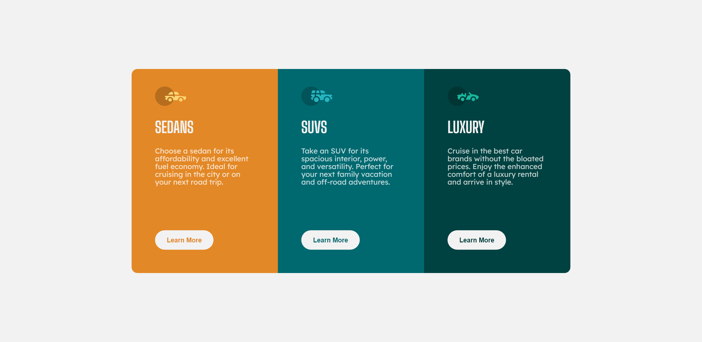
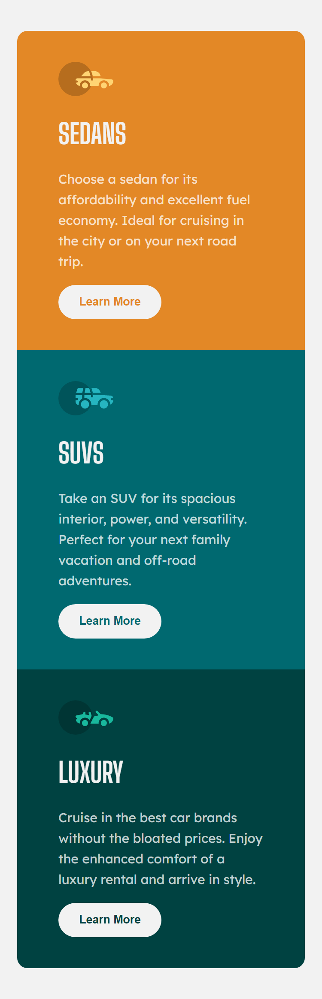

# Frontend Mentor - 3-column preview card component solution

This is a solution to the [3-column preview card component challenge on Frontend Mentor](https://www.frontendmentor.io/challenges/3column-preview-card-component-pH92eAR2-). Frontend Mentor challenges help you improve your coding skills by building realistic projects. 

## Table of contents

- [Overview](#overview)
  - [The challenge](#the-challenge)
  - [Screenshot](#screenshot)
  - [Links](#links)
- [What I learned](#what-i-learned)

**Note: Delete this note and update the table of contents based on what sections you keep.**

## Overview

### The challenge

Users should be able to:

- View the optimal layout depending on their device's screen size
- See hover states for interactive elements

### Screenshot
#### Desktop

#### Mobile


### Links

- Solution URL: https://github.com/ESLB/3-column-preview-card-component-main
- Live Site URL: https://eslb.github.io/3-column-preview-card-component-main/

## What I learned

Send element to end of div:
```css
.parent {
  display: flex;
}
.child {
  margin-top: auto;
}
```
Transform capitalization of text with css:
```css
h1 {
  text-transform: uppercase;
}
```
